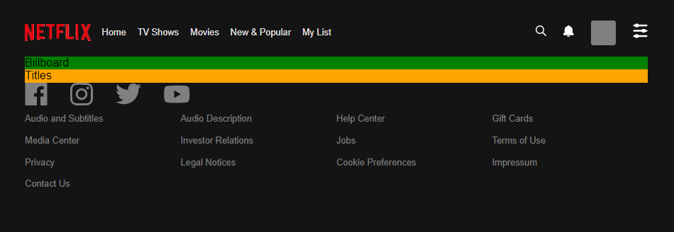

I've been a bit burned out on grinding coding problems, so I've decided to take a break and work on a project. For the project I've decided to make a Netflix clone using basic React.  I won't be going into heavy detail here for what I have done. I will just be posting some screen shots with a list of what I've accomplished for the day.

## Progress

